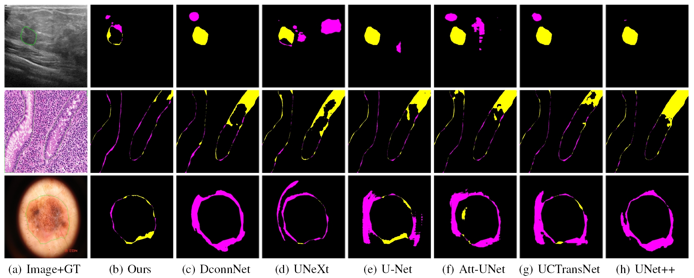

# Rolling-Unet
The official implementation of the paper ["Rolling-Unet: Revitalizing MLP’s Ability to Efficiently Extract Long-Distance Dependencies for Medical Image Segmentation"](https://doi.org/10.1609/aaai.v38i4.28173) published in AAAI-2024.


## Introduction
Medical image segmentation methods based on deep learning network are mainly divided into CNN and Transformer. However, CNN struggles to capture long-distance dependencies, while Transformer suffers from high computational complexity and poor local feature learning. To efficiently extract and fuse local features and long-range dependencies, this paper proposes Rolling-Unet, which is a CNN model combined with MLP. Specifically, we propose the core R-MLP module, which is responsible for learning the long-distance dependency in a single direction of the whole image. By controlling and combining R-MLP modules in different directions, OR-MLP and DOR-MLP modules are formed to capture long-distance dependencies in multiple directions. Further, Lo2 block is proposed to encode both local context information and long-distance dependencies without excessive computational burden. Lo2 block has the same parameter size and computational complexity as a 3×3 convolution. The experimental results on four public datasets show that Rolling-Unet achieves superior performance compared to the state-of-the-art methods.
<p align="center">
  
</p>


## Implementation
- The experimental environment of this paper includes:
Ubuntu 20.04 LTS system, an i9-12900K CPU, an NVIDIA RTX A6000 GPU, Python version 3.8, Pytorch version 1.13, and CUDA version 11.6.

- Clone this repository:
```bash
git clone https://github.com/Jiaoyang45/Rolling-Unet
cd Rolling-Unet
```

- In the paper, for the BUSI, GlaS, and CHASEDB1 datasets, we performed three random splits using the "train_test_split" function, with corresponding random seeds of 41, 1029, and 3407, respectively. ISIC 2018 dataset only performed random split once, with a corresponding seed of 41. To ensure the reproducibility of the experiment, we strictly set the random seeds for functions such as Torch, Python, and Numpy to 1029 using the "seed_torch" function.

- For the CHASEDB1 dataset, The "test_size" of "train_test_split" is not 0.2, but 0.27, which makes the training set exactly 20 images, which is a multiple of batch_size, in order to fully utilize the data for learning. The remaining 8 images are fully utilized for evaluation.


### Datasets
1) ISIC 2018 - [Link](https://challenge.isic-archive.com/data/)
2) BUSI - [Link](https://www.kaggle.com/aryashah2k/breast-ultrasound-images-dataset)
3) GLAS - [Link](https://websignon.warwick.ac.uk/origin/slogin?shire=https%3A%2F%2Fwarwick.ac.uk%2Fsitebuilder2%2Fshire-read&providerId=urn%3Awarwick.ac.uk%3Asitebuilder2%3Aread%3Aservice&target=https%3A%2F%2Fwarwick.ac.uk%2Ffac%2Fcross_fac%2Ftia%2Fdata%2Fglascontest&status=notloggedin)
4) CHASEDB1 - [Link](https://blogs.kingston.ac.uk/retinal/chasedb1/)


### Data Format
- Make sure to put the files as the following structure. For binary segmentation, just use folder 0.
```
inputs
└── <dataset name>
    ├── images
    |   ├── 001.png
    │   ├── 002.png
    │   ├── 003.png
    │   ├── ...
    |
    └── masks
        └── 0
            ├── 001.png
            ├── 002.png
            ├── 003.png
            ├── ...
```


### Training and Validation
- Train the model.
```
python train.py
```
- Evaluate.
```
python val.py
```
- This code includes visualization of the training process through [tensorboardX](https://github.com/lanpa/tensorboardX), and calculation multiple indicators through [MedPy](https://github.com/loli/medpy?tab=readme-ov-file).


## Acknowledgements
This code repository is implemented based on [UNeXt](https://github.com/jeya-maria-jose/UNeXt-pytorch). 


## References
1) UNet, UNet++, Attention-UNet - [link](https://github.com/bigmb/Unet-Segmentation-Pytorch-Nest-of-Unets)
2) Medical-Transformer - [link](https://github.com/jeya-maria-jose/Medical-Transformer)
3) UCTransNet - [link](https://github.com/McGregorWwww/UCTransNet?tab=readme-ov-file)
4) UNeXt - [link](https://github.com/jeya-maria-jose/UNeXt-pytorch)
5) DconnNet - [link](https://github.com/Zyun-Y/DconnNet)


## Citations
If this code is helpful for your study, please cite:
1) Liu, Y., Zhu, H., Liu, M., Yu, H., Chen, Z., & Gao, J. (2024). Rolling-Unet: Revitalizing MLP’s Ability to Efficiently Extract Long-Distance Dependencies for Medical Image Segmentation. Proceedings of the AAAI Conference on Artificial Intelligence, 38(4), 3819-3827. https://doi.org/10.1609/aaai.v38i4.28173

